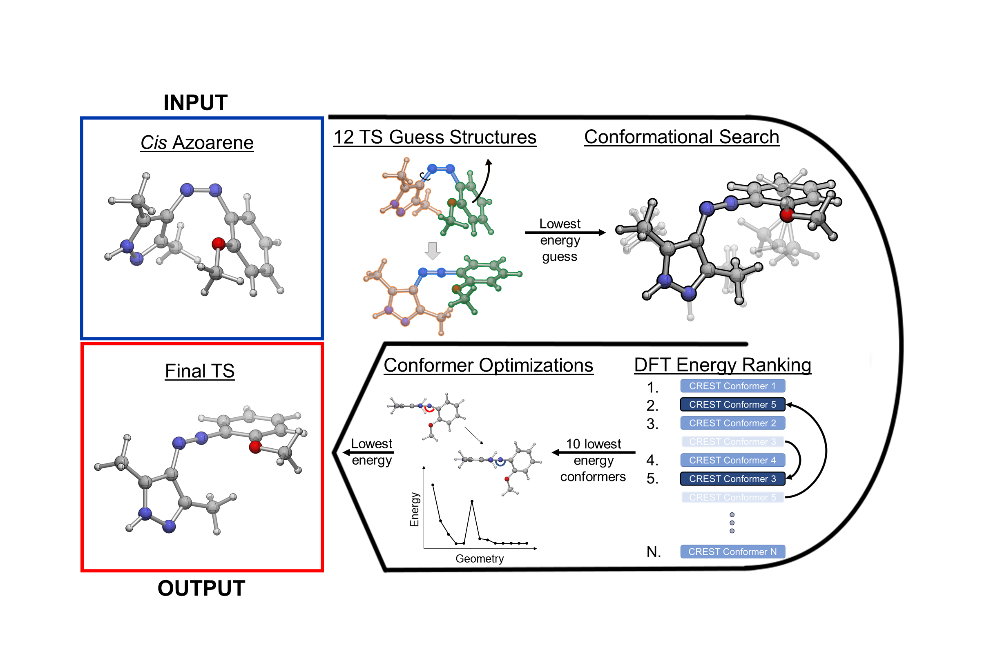

# EZ-TS
Automatic Azoarene Transition State Screening



## CODE SETUP

1. Clone the repository to your home directory:
```
$ git clone https://github.com/lopez-lab/EZ-TS.git
```
2. Execute ~/EZ-TS/init.sh to set up USER information and copy the EZTS tools to your ~/bin for easy access
```
$ bash init.sh
```
3. Dependent Package installations and interfacing:
    * OpenBabel must be installed prior to use
    * If starting calculations from SMILES, RDKIT environment must be active
    * Paths to all QM package executables should be set in the master /home/$USER/EZ-TS/config.py file

## USAGE
EZ-TS handles the setup and management of calculations by generating a batch of transition state guess structures for each molecule and writing a chain of calculation input/sbatch files to carry out the numerous pre-optimizations, conformational searches, conformer energy evaluations, and final optimizations. 

After completion, the lowest energy transition state found by EZ-TS for each molecule is copied to the base directory. 

With each step in the chain there are a number of potential hicups from ORCA, G16, CREST that EZ-TS does its best to correct and automatically resubmit.

   ### CALCULATION SETUP
To set up a workflow, in a directory of Gaussian log files or XYZ coordinate files execute ```EZTS-setup``` in that directory.
```
[Azoarenes]$ ls
>azothiophene.xyz
>azofuran.xyz

[Azoarenes]$ EZTS-setup
[Azoarenes]$ ls
>conf_opt/
>conf_search/
>input/
>lowerst_ts/
>start.sh
>ts_guess/
>utilities/
```
This will create the workflow architecture (placing the input structures in input/ ) and set up all calculations with the default parameters set in /home/USER/EZ-TS/config.py*

  * *You can edit the default config, or change the settings of a particular workflow by editing the config file in the /someworkflow/utilities/config.py

  * *To update input files in a workflow directory based on the local /someworkflow/utilities/config.py file, run ```re-configure```  in that workflow directory
            

To set up a workflow directly from a file SMILES file, use the ```-s``` flag and provide the file name: ```EZTS-setup -s SMILES.smi```
The SMILES.smi should have the SMILES string in column1 and the molecule name in column2:

    line1> C1(/N=N/C2=CC=CC=C2)=CC=CC=C1 Mol1
    line2> C1(/N=N/C2=CC=CO2)=CC=CO1 Mol2       
    line3> C1(/N=N/C2=CC=CS2)=CC=CS1 Mol3       
              

   ### RUN
To submit the workflow use the start.sh script in the base workflow directory: 
```
bash start.sh
```
   This will submit three jobs: an optimization array and two dependent jobs to handle failures
        
## UPDATING CODE

   To update the EZ-TS code in your home directory to the most recent version on this page, execute ```EZTS-update```


